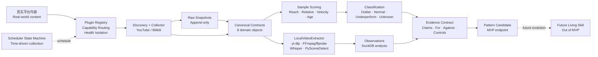

# 传播规律学习引擎 | Content Propagation Learning

**World Learning Loop MVP v0.1**

> 从真实世界的内容传播反馈中，学习“内容为什么被看见”，再把经过对照和反证的规律，逐步蒸馏成普通创作者可以使用的创作直觉。  
> Learn why content gets attention from real-world distribution evidence, then distill tested patterns into creative intuition that ordinary creators can use.

## 一句话核心总结 | One-line summary

这不是一个“预测下一个爆款”的工具，也不是把所有人变成同一种模板的内容工厂。它是一套**跨平台、证据优先的内容传播学习系统**：收集真实作品和时间快照，用同一创作者的 Outlier / Normal / Underperform 做对照，尽可能在本地解构视频，再把支持证据、反例和控制样本组织成可追溯的 `Pattern Candidate`。

This is not a “next-viral-video predictor” or a template factory. It is a **cross-platform, evidence-first content learning system**: collect real works and metric snapshots, compare Outlier / Normal / Underperform samples within creator context, decompose video locally where possible, and turn support, counterexamples, and controls into traceable `Pattern Candidate` records.

## 架构一览 | Architecture at a glance



**核心原则 | Core rule:** 平台复杂性留在插件内，Core 只理解能力、契约、证据和状态。  
Platform complexity stays inside plugins; Core understands only capabilities, contracts, evidence, and state.

## 对用户的价值 | User value

### 对普通创作者 | For ordinary creators

- 不再只问“这条为什么火”，而是看到它与同类普通作品、失败作品的差异。  
  Go beyond “why did this one go viral?” and see how it differs from normal and underperforming peers.
- 减少凭感觉追热点、照抄模板和反复试错，把复杂数据转化为更接近创作现场的提示。  
  Reduce blind trend-chasing and template copying by turning complex data into practical creative signals.
- 找到适合自己题材和表达方式的“那个瞬间”，让偶尔的超预期传播成为继续创作的正反馈。  
  Find the moment that fits your own topic and voice, so occasional unexpected reach becomes positive feedback to keep creating.
- 同时学习成功和失败：一个规律如果经不起反例，就不会被包装成“爆款秘诀”。  
  Learn from both success and failure; a pattern that cannot survive counterexamples is not sold as a “viral secret.”

### 对内容研究者和工具开发者 | For researchers and builders

- 保留 `Raw → Observation → Interpretation → Evidence → Pattern` 的完整链路。  
  Preserve the full `Raw → Observation → Interpretation → Evidence → Pattern` chain.
- 可以替换平台采集器、本地分析器和存储实现，不让某个平台或某个模型绑架核心。  
  Swap platform adapters, local analyzers, or storage without coupling the Core to one platform or model.
- 每个结论都能回答：谁采集的、何时采集的、基于哪些样本、有哪些反证。  
  Every conclusion can answer who collected it, when, from which samples, and what contradicted it.

## 当前 MVP 能做什么 | What the MVP does

- 接入 YouTube 与 Bilibili 的公开 metadata discovery / collection。  
  Public metadata discovery and collection for YouTube and Bilibili.
- 用最近 20 条有效作品的中位播放建立创作者基线，最低 8 条，不足时返回 `unknown`。  
  Creator baseline from the latest 20 valid works, requiring at least 8; otherwise return `unknown`.
- 分离绝对传播、相对表现、增长速度、内容年龄和互动信号，不制造不可解释的总分。  
  Keep reach, relative performance, velocity, age, and engagement signals separate instead of inventing an opaque composite score.
- 本地接入 yt-dlp、FFmpeg/ffprobe、faster-whisper、PySceneDetect；OCR 保持 optional。  
  Local hooks for yt-dlp, FFmpeg/ffprobe, faster-whisper, and PySceneDetect; OCR remains optional.
- 用 SQLite 保存 Core 与 Raw Snapshot，用 DuckDB 保存可重算的分析结果。  
  SQLite stores Core entities and raw snapshots; DuckDB stores recomputable analysis.
- 通过 CLI 运行采集、评分、提取、插件检查和 Integration Proof 01。  
  Run collection, scoring, extraction, plugin checks, and Integration Proof 01 through the CLI.

## 当前版本刻意不做 | Explicit non-goals

MVP 终点是 `Pattern Candidate`，不是 `Living Skill`。当前不包含自动发布、WebUI、用户系统、多 Agent、爆款概率预测或自动修改 Skill。  
The MVP ends at `Pattern Candidate`, not `Living Skill`. It does not include auto-publishing, WebUI, user accounts, multi-agent orchestration, viral probability prediction, or automatic Skill mutation.

现在的仓库先把“可靠学习”这条底座做实；面向普通创作者的自然语言 Skill，是后续建立在证据之上的上层产品。  
This repository first makes reliable learning infrastructure real; a natural-language Skill for creators is a later layer built on top of evidence.

## 冻结边界 | Frozen boundary

- 平台 / Platforms: YouTube, Bilibili。
- Discovery: `keyword`, `creator`, `seed_url`。
- Raw facts are append-only；派生数据可重新计算，分析结果可版本化。  
  Raw facts are append-only; derived data is recomputable and analysis is versioned.
- Core 只依赖 Capability Contract，不包含平台分支。  
  Core depends on capability contracts, not platform-specific branches.
- 研究分类 / Research classes: `outlier`, `normal`, `underperform`, `unknown`; also retain `mega_viral`, `rising`, and `evergreen` signals.
- Evidence 必须容纳支持证据、反证、控制样本和 Provenance。  
  Evidence must accommodate support, counterevidence, controls, and provenance.
- Evolution Contract 保留后续状态，但 MVP 自动停在 `candidate`。  
  Later evolution states remain contractual, but MVP automation stops at `candidate`.

## 目录结构 | Layout

```text
core/                 contracts, scoring, evidence, scheduler, registry
plugins/platforms/    YouTube/Bilibili adapters
plugins/extractors/   LocalVideoExtractor
plugins/storage/      SQLite Core Store and optional DuckDB analysis
cli/                  CLI and Integration Proof 01
data/                 local raw/media/derived artifacts
patterns/             candidate/validated/deprecated outputs
tests/                unittest coverage
```

## 运行 | Run

Use Python 3.12 / 使用 Python 3.12：

```text
py -3.12 -m cli.main init
py -3.12 -m cli.main plugins
py -3.12 -m cli.main score --input score-input.json
py -3.12 -m cli.main proof01
```

Live metadata verification is explicit because it uses public network sources / 实时验证会访问公开网络：

```text
py -3.12 -m cli.main proof01 --live
```

The live proof collects metadata only. Two seed videos do not establish a creator baseline or a reliable pattern. Add `--video-path` to exercise the local extractor on a downloaded local file.  
Live proof 只采集元数据；两个 seed 视频不足以建立创作者基线或可靠规律。添加 `--video-path` 可对本地下载文件运行提取器。

Optional capabilities / 可选能力：

```text
py -3.12 -m pip install -e .[collection,analysis,extraction]
```

Missing optional tools produce an explicit `partial` or unavailable result; they are never silently substituted.  
缺失的可选工具会明确返回 `partial` 或 unavailable，不会被静默伪造或替换。

## Integration Proof 01

Fixture mode creates a fully traceable, clearly labelled candidate and persists it through SQLite and DuckDB. This proves schema, scoring, evidence, and persistence wiring; it is not world evidence.  
Fixture 模式会创建一个明确标注的可追溯候选，并写入 SQLite 与 DuckDB；它验证契约、评分、证据和持久化 wiring，但不代表真实世界证据。

Live mode validates the platform adapters and raw-to-canonical path. It intentionally reports insufficient evidence for baseline, controls, and a real pattern when only one seed per platform is supplied. That is a valid evidence-first outcome.  
Live 模式验证平台适配器和 Raw-to-Canonical 链路；每个平台只有一个 seed 时，会有意报告基线、控制样本和真实规律证据不足。这是符合 Evidence-first 的有效结果。
